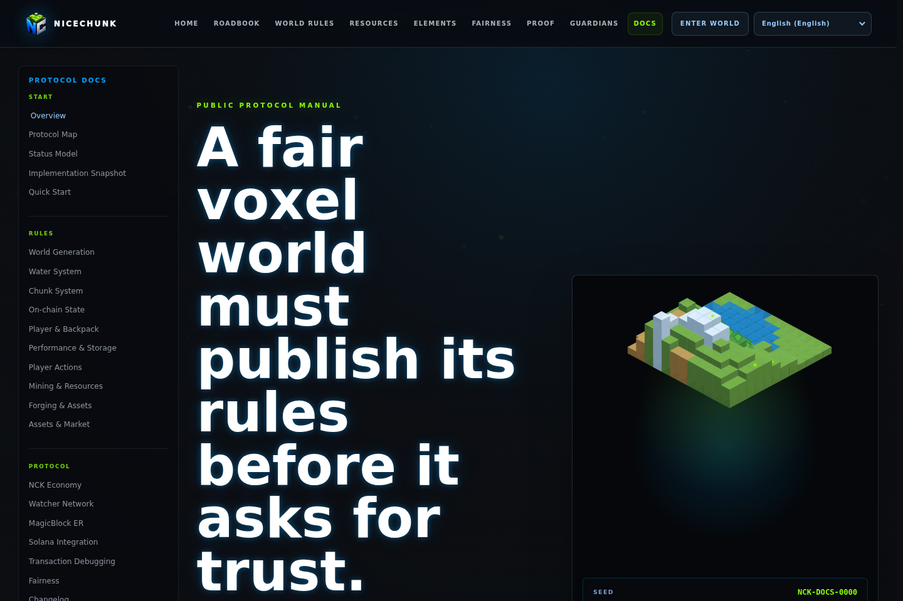
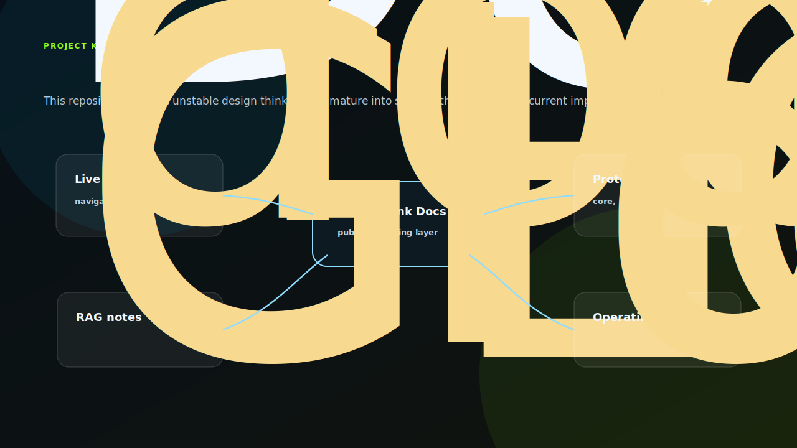

# NiceChunk Docs

Design documents, protocol notes, and developer documentation.

## Project Overview

This repository contains NiceChunk documentation and design notes. It covers architecture decisions, i18n expectations, Solana program documentation, Guardian notes, chunk rules, and optimization notes.

The docs repository is intentionally separate from code-heavy repositories so long-form explanations can evolve without adding noise to implementation reviews.

It acts as the place where design intent, protocol assumptions, and implementation boundaries are made explicit.

## Knowledge Topology

The docs repository sits between implementation and specification. Some files are stable public documentation; others are working notes that capture design reasoning before it is ready to become a formal contract. That split is intentional.

The browser docs page explains the project through live demos and cached locale dictionaries. The Markdown documents preserve deeper protocol reasoning: chunk behavior, global configuration, player state, Guardian design, MagicBlock notes, i18n rules, and storage optimization. A good documentation change should make one of those boundaries clearer.

## System Principles

- Documentation should explain why a system exists, not only what files contain.
- Developer-facing documents should stay close to implementation reality and be updated when code changes.
- Long-form design notes should be allowed to evolve before they become strict specs.
- Public docs should avoid private deployment details and local machine configuration.

## How It Works

- Use the docs page for navigable browser documentation.
- Keep Markdown documents focused on architecture, protocol, and operational reasoning.
- Cross-link docs to the relevant split repositories when a topic becomes its own project.
- Update screenshots and examples when public pages or program interfaces change.

## Why This Project Matters

NiceChunk is now a multi-repository project. Without a strong documentation layer, contributors cannot understand how world rules, programs, assets, services, and UI relate.

A dedicated docs repository gives the project a durable knowledge base.

## Repository Layout

- `docs/`
- `optimization-notes/`
- `CHUNK_RAG.md`
- `GLOBAL_CONFIG_RAG.md`
- `PLAYER_SET_RAG.md`

## Development Workflow

1. Clone the repository and inspect the focused source tree before changing shared contracts or generated artifacts.
2. Keep changes scoped to the domain of this repository. Cross-domain changes should be coordinated through the matching split repositories.
3. Run the smallest meaningful validation for the touched surface: build checks for programs, browser checks for pages, or fixture checks for deterministic libraries.
4. Update screenshots and documentation when behavior, visible UI, public constants, or developer-facing workflows change.

## Future Development Direction

- Create versioned docs for public releases.
- Add architecture diagrams that show repository boundaries and runtime dependencies.
- Promote stable design notes into formal specifications.
- Add contribution guides for protocol, frontend, assets, and Guardian development.

## Maintenance Notes

This repository is a focused split from the main NiceChunk working tree. Keep the public surface explicit: avoid committing private keys, wallet files, deployment-only scripts, machine-specific configuration, or generated build artifacts. Runtime user-facing copy should stay behind the i18n layer where the project has an i18n surface.
